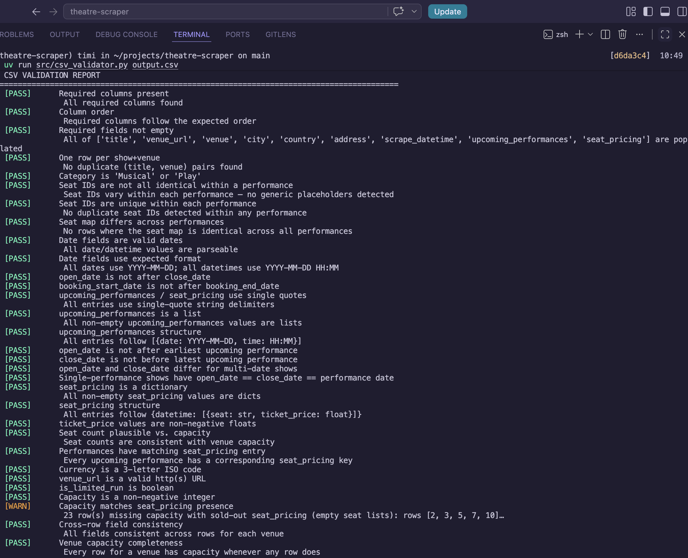

# Malthouse Theatre Scraper

A production-style web scraper for extracting theatre event listings from the [Malthouse Theatre website](https://malthousetheatre.co.uk/whats-on) and exporting them into a validator-compatible CSV format.

The scraper crawls the event listing page, visits each show detail page, normalizes inconsistent theatre scheduling text, and emits structured records compatible with the provided CSV validator specification.

---

# Features

* Discovers all event detail pages automatically
* Extracts:

  * title
  * venue metadata
  * category
  * date ranges
  * performance schedules
* Normalizes inconsistent theatre date formats
* Outputs validator-compatible CSV rows
* Handles malformed human-written event text heuristically
* Includes parser unit tests
* Produces validator-safe `seat_pricing` structures

---

# Libraries Used

## [httpx](https://www.python-httpx.org)

Used for HTTP requests.

Why:

* modern async-ready API
* cleaner ergonomics than `requests`
* reliable timeout/retry behavior
* lightweight dependency footprint

---

## [BeautifulSoup4](https://www.crummy.com/software/BeautifulSoup/bs4/doc)

Used for HTML parsing.

Why:

* robust against malformed HTML
* easy DOM traversal
* ideal for semi-structured scraping targets like theatre websites

---

## [python-dateutil](https://dateutil.readthedocs.io/en/stable)

Used for fuzzy date parsing.

Why:
The target website contains inconsistent date formats such as:

* `Sunday 24th May 2026`
* `28th – 30th May 2026`
* `Fri 10th, Sat 11th & Sun 12th`
* `7.30pm`
* marketing text embedded inside date blocks

Using `dateutil.parser` significantly reduces brittle custom parsing logic.

---

## [Pydantic](https://docs.pydantic.dev/latest)

Used for schema validation and serialization safety.

Why:

* catches malformed dates/times early
* enforces output contracts
* validates performance structures before CSV emission

---

## [pytest](https://docs.pytest.org/en/stable)

Used for parser unit testing.

Why:

* minimal boilerplate
* excellent assertion introspection
* standard testing framework in Python ecosystems

---

# Project Structure

```text
src/
├── scraper.py
├── parser.py
├── models.py
├── utils/
│   └── csv_validator.py

tests/
└── test_parser.py
```

---

# How to Run

## 1. Create virtual environment

Using [uv](https://docs.astral.sh/uv):

```bash
uv venv
source .venv/bin/activate
```

---

## 2. Install dependencies

```bash
uv sync
```


---

## 3. Run scraper

```bash
uv run src/scraper.py
```

This generates:

```text
output.csv
```

---

## 4. Run validator

```bash
python src/utils/csv_validator.py output.csv
```

---

## 5. Run tests

```bash
pytest
```

or:

```bash
uv run pytest
```

---

# CSV Validator Compatibility

The scraper was designed specifically to satisfy the supplied validator rules.

Important implementation details:

* `upcoming_performances` is emitted as a Python-style list literal
* `seat_pricing` is emitted as a Python-style dict literal
* dates use `YYYY-MM-DD`
* times use `HH:MM`
* `scrape_datetime` uses `YYYY-MM-DD HH:MM`

---

# Date Parsing Strategy

The Malthouse Theatre site does not expose dates in a consistent machine-readable format.

Examples observed during scraping include:

```text
Sunday 24th May 2026
28th – 30th May 2026
Fri 10th, Sat 11th & Sun 12th
7.30pm
Price: Adults £25.00 BOOK NOW
```

The parser normalizes these using:

* regex cleanup
* fuzzy parsing (`dateutil.parser`)
* ordinal stripping (`24th` → `24`)
* inherited month/year inference for abbreviated ranges
* inline time extraction
* marketing/CTA cleanup
* whitespace normalization

---

# Seat Pricing Notes

The target website does not expose structured seat-level inventory or seat maps publicly.

To comply with the validator contract:

```python
{
    "YYYY-MM-DD HH:MM": []
}
```

is emitted for each performance.

This represents:

* sold-out performances
* unavailable seat inventory
* general admission / unreserved layouts
* non-public seating data

Placeholder seat IDs are intentionally avoided because the validator treats repeated fake seat IDs as scraper failures.

---

# Could a JSON API Have Been Used?

Possibly, but none was reliably exposed publicly during assessment.

The site appears to be WordPress + Elementor-based, and some WordPress sites expose event metadata through:

* REST endpoints
* embedded JSON
* schema.org metadata
* internal AJAX APIs

I inspected the site structure and network behavior but did not find a stable public API suitable for production extraction.

The scraper therefore relies on server-rendered HTML parsing.

With more time, I would further investigate:

* hidden XHR endpoints
* embedded JSON-LD blocks
* WordPress REST namespaces
* Elementor data payloads

---

# What Breaks if the Site Changes

This scraper depends heavily on:

* current HTML structure
* current text conventions
* visible event metadata

Potential break points include:

* changes to labels like:

  * `Dates & Times`
  * `Price:`
* removal of server-rendered content
* migration to client-side rendering
* structural Elementor changes
* changes in date punctuation/range formatting
* multiple performance schedules embedded differently

Because the site uses human-written theatre copy rather than structured scheduling data, parser resilience depends on heuristic normalization.

---

# Known Limitations

The source website contains highly inconsistent human-written date strings.

Some edge cases may still fail if:

* a date omits both month and year
* multiple unrelated schedules appear in one block
* pricing text interrupts dates unpredictably
* performance schedules are represented entirely as prose
* multiple times exist for a single date

The parser currently uses heuristic normalization rather than a fully semantic event scheduling engine.

---

# What I Would Do With More Time

## Improve Schedule Extraction

## Improve Reliability

* add snapshot tests using real production pages
* add parser confidence scoring
* add anomaly detection/logging
* add structured fallback extraction paths

---

## Improve Extraction Quality

* investigate hidden APIs/XHR requests
* parse embedded JSON-LD/schema.org metadata
* support richer pricing extraction
* detect venue-specific templates dynamically

---

## Improve Architecture

* add async crawling
* persist raw HTML for debugging
* add structured observability metrics
* containerize scraper execution

---

# Assumptions Made

* Default performance time is `19:30` when no explicit time exists
* Events spanning date ranges are assumed to run continuously
* Currency is always `GBP`
* Venue metadata is static for all rows

---

# Notes

This scraper prioritizes:

* validator compatibility
* resilience against inconsistent theatre copy
* predictable structured output

over perfect semantic interpretation of every human-written schedule variation.

# CSV Validator test screenchot

